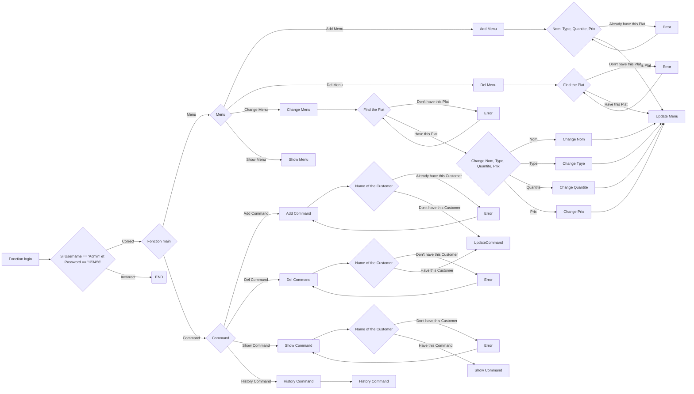

# Projet Final

###### GitHub Link: https://github.com/Marshellson/projectfinal

 Ce Readme a été écrit le 19 Mai 2020

---
###### Je(JIANG Yilun) ai terminé ce projet sépatément, donc s'il y a des erreurs grammaticales françaises dans le code ou ce fichier, veuillez me pardonner.

## 1. L'introduction

### 1️⃣ Le but de l'écriture de ce code:

Ceci est mon projet final en python au deuxième semestre de la première année d'EPF

### 2️⃣ Arrière-plan de conception

Il s'agit d'un programme qui sert les serveurs de restaurant et peut mieux gérer les restaurants en ajoutant des commandes ou en gérant les commandes des restaurants.

### 3️⃣ Définition du vocabulaire 

`Nom1_Nom2_Nom3` --> Fonction Nom1 --> Fonction Nom2 --> Fonction Nom3 ex.

 Exemple: `window_del_command_show` == Fonction window --> Fonction del_command --> Fonction tk.TK (Créer une Window)

### 4️⃣ Référence

PDF ( [Projet - TROYES - Sujet](https://moodle.epf.fr/mod/resource/view.php?id=60598))

---

## Résultat de développement réels

### ⚀ Produit

 [Version2.py](Version2.py) 

 [menu](menu) [Ce fichier est utilisé pour stocker des données de menu]

 [commands](commands) [Ce fichier est utilisé pour stocker les données de commande]

### ⚁ La fonction principale

Ajouter et supprimer des menus, modifier le contenu du menu, ajouter et supprimer des commands, afficher les commands historiques et afficher les revenus du restaurant.

### ⚂ Organigramme

##### Je vous suggère que d'utiliser l'application `Typora` ou `Haroopad` pour ouvrir ce ficher.

---

---

### ⚃ Progression de la conception

Il existe en fait trois versions de ce programme: la première version est basée sur le fonctionnement du terminal, la deuxième version est basée sur le module intégré Python tkinter pour l'écriture GUI, et la troisième version voulait à l'origine être utilisée pour optimiser le code et utiliser PyQt5, mais en raison du temps limité, la troisième version n'est actuellement pas disponible.

En résumé, la progression réelle est de 3 à 4 jours plus lente que la progression attendue, en raison de la préparation de l'examen final, etc.

---

## Évaluation du développement

### 1️⃣ Évaluation de l'efficacité de la production

L'efficacité globale de la production est assez satisfaisante: la première version est développée en une journée et la deuxième version est terminée en 4 jours environ.

### 2️⃣ Évaluation de la qualité des produits

En raison du problème de préparation des connaissances au début, la programmation orientée objet n'a pas été utilisée, ce qui a rendu le code trop compliqué à comprendre; la deuxième version a été écrite lorsque la première version n'était pas terminée, donc la première version était également une version incomplète.

La dénomination des variables doit également être améliorée.

Mais dans l'ensemble, la qualité du code est relativement élevée, et les résultats sont plus satisfaisants.

---

## Conclusion 

Je suis assez satisfait de ce projet. Comme la deuxième version utilise tkinter, la syntaxe est relativement simple, l'effet est relativement simple et il ne montre pas un bon effet d'interface. La troisième version est actuellement en cours de développement, C'est après avoir soumis le devoir, mais je vais encore améliorer et refactoriser cette partie du code pour obtenir les meilleurs résultats.

Bonne vacances à vous, et je vous souhaite une bonne journée .

Fait à Troyes ,

le 29/05/2020

