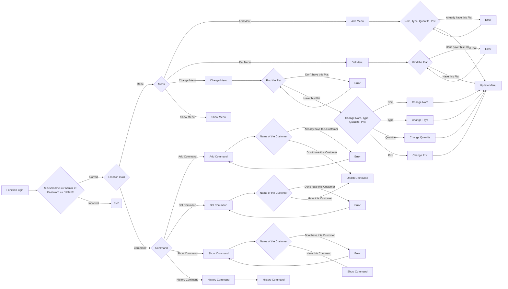

# Projet Final

###### GitHub Link: https://github.com/Marshellson/projectfinal

 Ce Readme a été écrit le 19 Mai 2020

---
###### Je(JIANG Yilun) ai terminé ce projet sépatément, donc s'il y a des erreurs grammaticales françaises dans le code ou ce fichier, veuillez me pardonner.

## 1. L'introduction

### 1️⃣ Le but de l'écriture de ce code:

Ceci est mon projet final en python au deuxième semestre de la première année d'EPF

### 2️⃣ Arrière-plan de conception

Il s'agit d'un programme qui sert les serveurs de restaurant et peut mieux gérer les restaurants en ajoutant des commandes ou en gérant les commandes des restaurants.

### 3️⃣ Définition du vocabulaire 

`Nom1_Nom2_Nom3` --> Fonction Nom1 --> Fonction Nom2 --> Fonction Nom3 ex.

 Exemple: `window_del_command_show` == Fonction window --> Fonction del_command --> Fonction tk.TK (Créer une Window)

### 4️⃣ Référence

PDF ( [Projet - TROYES - Sujet](https://moodle.epf.fr/mod/resource/view.php?id=60598))

---

## Résultat de développement réels

### ⚀ Produit

 [Version2.py](Version2.py) 

##### Je vous suggère que d'utiliser l'application `Typora` ou `Haroopad` pour ouvrir ce ficher.

---

---

